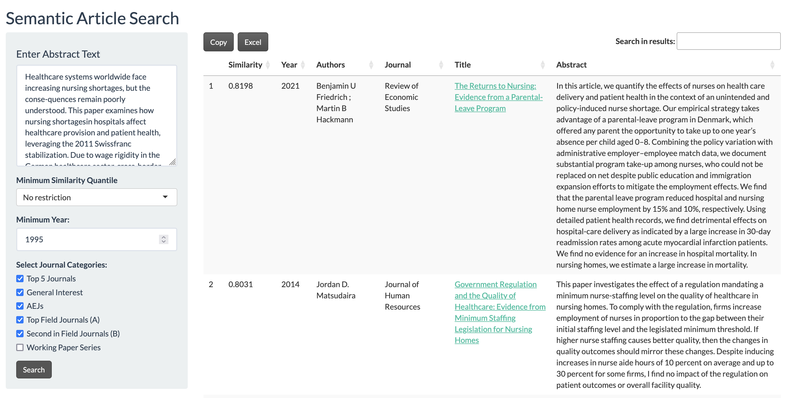

# econpapersearch: Semantic Article Search for Economic Research

This Shiny app provides a proof-of-concept **semantic search engine** for economic research articles indexed in RePEc. It allows users to find relevant papers based on abstract similarity using **LLM-powered embeddings**.   
🔍 **Try it now:** [https://econpapers.eduard-bruell.de/](https://econpapers.eduard-bruell.de/)




## Features
- **Semantic Search:** Paste an abstract or search text, and the app retrieves semantically similar articles.
- **Download & Export:** Results can be copied or exported as an Excel file.
- **Direct Access:** Each result includes a clickable link to the article’s full text (when available).

## Data Pipeline
The app relies on an automated monthly pipeline that:

1. **Downloads** ReDIF files from RePEc FTP servers using **lftp**.
2. **Parses & Cleans** metadata, extracting abstracts, authors, and journal details.
3. **Generates Text Embeddings** using the **tidyllm** package and stores them in a **DuckDB** database
4. **Updates the Shiny App**, refreshing the dataset for the latest available articles.

## Usage
1. **Enter Abstract or Keywords** in the search box.
2. **Select Filters** such as minimum publication year and journal categories.
3. **Click "Search"** to retrieve and rank articles by semantic similarity.
4. **Browse Results**, click article titles to view full texts, or export results as needed.

## Deployment & Automation
- The app runs continuously, except for a short downtime during the **monthly update** (first Saturday-Sunday night of the month).
- Data is stored using **DuckDB**
- Embeddings are calculated in **Ollama (mxbai-embed-large)** via **tidyllm** for semantic similarity computation.

## Backends

The app supports two interchangeable backends for parsing ReDIF metadata files:

### 1. Perl-Based Backend (Recommended)

- **File:** `parse_rdf_perl_backend.R`
- Uses the RePEc `ReDIF-perl` tools to convert `.redif` files into structured JSON
  - **Pipeline:** `.rdf/.redif` → `JSON` → `RDS` → `DuckDB`
- More robust to formatting issues and edge cases.
- Supports BibTeX citation generation.
- Requires a local installation of Perl and `ReDIF-perl`

### 2. R-Native Backend

- **File:** `parse_redif_files.R`
- Pure R implementation, no external dependencies.
- Faster and simpler to run.
- Less robust to encoding quirks and non-standard fields.
- Does not currently generate BibTeX entries or reliably parse complex author metadata.


### Example CRON Jobs
To automate the update process, add the following entries to your crontab on the server you host the app:

```bash
# Stop Shiny app, run updates, then restart (first Sunday of each month at 2 AM)
0 2 * * 7 [ "$(date +%d)" -le 07 ] && /path/to/update_pipeline.sh
```

Example `update_pipeline.sh` script:

```bash
#!/bin/bash
# Stop Shiny app
sudo systemctl stop shiny-server

# Run scripts
Rscript /srv/shiny-server/econpapersearch/sync_ftp_archive.R
Rscript /srv/shiny-server/econpapersearch/parse_rdf_perl_backend.R
Rscript /srv/shiny-server/econpapersearch/embed_collection.R

# Restart Shiny app
sudo systemctl start shiny-server
```