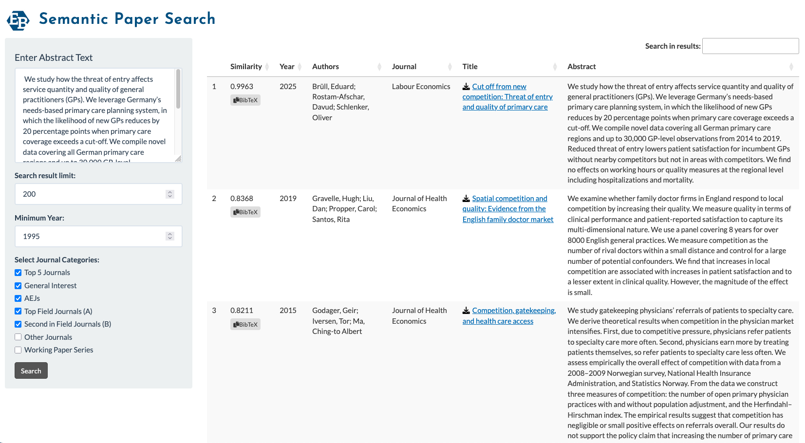

# econpapersearch: Semantic Article Search for Economic Research

> ⚠️ **This is an old version of [eddyspapers](https://github.com/edubruell/eddyspapers). based purely and shiny** Both the REPEC integration and frontend have changed massively from this version.

This Shiny app provides a proof-of-concept **semantic search engine** for economic research articles indexed in RePEc. It allows users to find relevant papers based on abstract similarity using **LLM-powered embeddings**.   
🔍 **Try it now:** [https://econpapers.eduard-bruell.de/](https://econpapers.eduard-bruell.de/)




## Features
- **Semantic Search:** Paste an abstract or search text, and the app retrieves semantically similar articles.
- **Download & Export:** Results can be copied or exported as an Excel file.
- **Direct Access:** Each result includes a clickable link to the article’s full text (when available).


## Data Pipeline

The app is powered by a reproducible and automated monthly pipeline, launched via `run_pipeline.R`, which:

1. **Synchronizes** ReDIF metadata from RePEc FTP servers using **lftp**.
2. **Parses and Cleans** metadata using a **Perl** or **R-native** backend.
3. **Generates Text Embeddings** using the **tidyllm** package with **Ollama (mxbai-embed-large)**.
4. **Updates the DuckDB Database**, making new articles available in the app.

> The script `run_pipeline.R` handles all of the above steps sequentially with logging and error handling. Logs are saved in the `logs/` directory.


## Deployment & Automation

- The Shiny app runs continuously, except for a short maintenance window during the **monthly update** (typically the first Sunday night of the month).
- Data is stored using **DuckDB**, and embeddings are computed using **tidyllm** + **Ollama**.

### CRON-Based Automation

Example CRON entry to run the pipeline on the first Sunday of each month at 2 AM:

```bash
0 2 * * 7 [ "$(date +%d)" -le 07 ] && Rscript /srv/shiny-server/econpapersearch/run_pipeline.R
```
## Backends

The app supports two interchangeable backends for parsing ReDIF metadata files:

### 1. Perl-Based Backend (Recommended)

- **File:** `parse_rdf_perl_backend.R`
- Uses the RePEc `ReDIF-perl` tools to convert `.redif` files into structured JSON
  - **Pipeline:** `.rdf/.redif` → `JSON` → `RDS` → `DuckDB`
- More robust to formatting issues and edge cases.
- Supports BibTeX citation generation.
- Requires a local installation of Perl and `ReDIF-perl`

### 2. R-Native Backend

- **File:** `parse_redif_files.R`
- Pure R implementation, no external dependencies.
- Faster and simpler to run.
- Less robust to encoding quirks and non-standard fields.
- Does not currently generate BibTeX entries or reliably parse complex author metadata.


